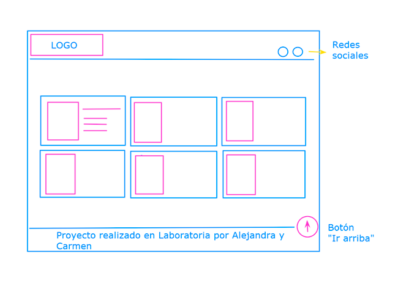
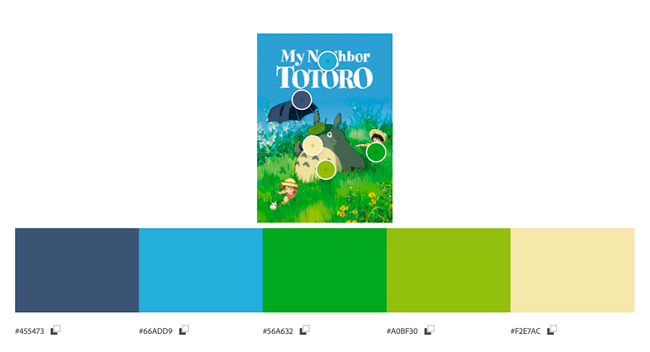

# Studio Ghibli

Studio Ghibli es un estudio de animación japonés, conocido por sus largometrajes
animados como **Mi vecino Totoro**, **El viaje de Chihiro** o
**El castillo ambulante**, entre otros grandes éxitos.

Las animaciones tienen gran acogida a nivel mundial y algunas han recibido varias nominaciones y premios. De todo este fandom hay un grupo que desea poder interactuar y ver la información de las animaciones.

# Usuarios

## ¿Quiénes son los principales usuarios de la web?
Los principales usuarios de la web son todos aquellos que se consideran fanáticos de las animaciones de Studio Ghibli. Además, quienes estén interesados en conocer las películas del Studio.

## ¿Cuáles son los objetivos de estos usuarios en relación con el producto?
Los usuarios quieren encontrar en un mismo lugar toda la información sobre las películas, personajes, directores y productores de Studio Ghibli y poder interactuar con ella para obtener los datos en los que estén interesados en el momento de la consulta.

## ¿Cuáles son los datos más relevantes que quieren ver en la interfaz y por qué?
Los usuarios quieren ver desplegadas la totalidad de las películas del Studio Ghibli y su información más relevante y poder acceder a información detallada de cada una. 

## Los datos más relevantes son:
* Studio Ghibli tiene varias animaciones, para nuestros usuarios es importante saber cuántas y cuáles son.
* Las animaciones tienen directores y productores. Ellos son las mentes detrás de una gran animación. En Studio Ghibli hay directores y productores que han colaborado en la creación de más de una animación. Por ello, es importante para nuestro usuario poder conocerlos y saber cuántas y cuáles son las animaciones a las que dieron "vida".
* Las animaciones tienen información relevante para nuestras usuarias, como descripción, fecha de lanzamiento, calificación, director, productor.

Todo esto es importante para los usuarios porque les permitirá conocer más sobre su estudio de animación favorito y tener toda esta información disponible para cuando la necesiten.

## ¿Cuándo utilizan o utilizarían el producto?
Los usuarios utilizan la página cuando:
* Se reúnen con otros fanáticos a comentar sobre las películas de Studio Ghibli.
* Antes de ver una película de Studio Ghibli y quieren más información sobre ella.
* Antes de definir qué película de Studio Ghibli verán.
* Después de ver una película de Studio Ghibli para tener más información sobre ella.

# Historia de usuario

## Historia de Usuario 1
**Yo, como parte del fandom de Studios Ghibli, quiero una página en la que pueda encontrar todas las películas con su año de estreno, además de su director y productor para acceder a esta información cuando quiera comentar sobre las películas con mis amigos.**

* Maquetación.
* La página está desarrollada con HTML semántico.
* Se aplica Grid Layout en CSS.
* Se conecta la data de Javascript con HTML.
* El código en Javascript para el botón que permite volver al inicio de la página, está implementado y funcionando.
* El código está en el repositorio local y en GitHub.
* La historia de usuario está desplegada en GH Pages.
* La historia ha sido testeada con al menos 2 usuarios y se incorporaron las mejoras que se identificaron en el testeo de usabilidad.

## Historia de Usuario 2
**Yo, como usuario de la página, quiero ordenar las películas cronológicamente, en orden cronológico inverso, en orden alfabético y en orden alfabético inverso para verlas en el orden que me parezca más conveniente.**

* Hay un campo select en HTML y JavaScript para desplegar las 4 opciones de orden.
* Se puede ordenar las películas en orden cronológico.
* Se puede ordenar las películas en orden cronológico inverso.
* Se puede ordenar las películas en orden alfabético.
* Se puede ordenar las películas en orden alfabético inverso.
* El estilo en CSS va acorde a los demás elementos de la página.
* El usuario puede manejar el campo para ordenar en la página web.

## Historia de Usuario 3
**Yo, como usuario de la página, quiero filtrar las películas por productor y director para identificar las peliculas que hicieron cada uno.**

* Hay un campo select en HTML y JavaScript para desplegar 2 opciones de filtrado.
* Se puede filtrar las películas por director.
* Se puede filtrar las películas por productor.
* El estilo en CSS va acorde a los demás elementos de la página.
* El usuario puede manejar el campo para filtrar en la página web.

## Historia de Usuario 4
**Yo, como usuario de la página, quiero calcular en cuántas películas ha trabajado cada productor y director para conocer su nivel de productividad en el estudio.**

* Se puede calcular las películas por director.
* Se puede calcular las películas por productor.
* El cálculo se muestra cuando se activan los campos “select” del filtrado.
* El estilo en CSS que va acorde a los demás elementos de la página.
* El usuario puede manejar el campo para calcular en la página web.

## Historia de Usuario 5
**Yo, como usuario de la página, quiero ver la reseña de cada película y su calificación.**

 * Hay un botón dinámico que permite mostrar una sección de la página (ir a la página de la película).
 * Hay un botón que permite ocultar una sección de la página (volver a la página principal).
* Se muestran los contenidos de cada película de forma dinámica.
* El estilo en CSS que va acorde a los demás elementos de la página.
* El usuario puede manejar los botones y ve la información de cada película.

# Interfaz de usuario

## Prototipo de baja fidelidad

## Paleta de colores
Inicialmente teníamos otra paleta de colores que decidimos cambiar por los resultados obtenidos en el test de usabilidad.

## Prototipo de alta fidelidad
[Prototipo de alta fidelidad](https://www.figma.com/proto/1pBwiEn7PphIITvpaG1AoX/Data-lovers-team-library?node-id=415%3A229&scaling=min-zoom&page-id=0%3A1&starting-point-node-id=415%3A229)

# Test de usabilidad

Este test fue realizado a tres usuario que son parte del fandom del Studio Ghibli y nos hicieron observaciones principalmente sobre la apariencia de la web. Considerando sus recomendaciones, tomamos las siguientes decisiones:
* Cambiar la paleta de colores por una que evoque los colores de la naturaleza.
* Pusimos figuras de las películas en los botones.
* Especificamos el porcentaje de películas realizadas por director y productor.

## Pila de tecnología:

### Interfaz

`HTML` `CSS` `JavaScript`

## Descripción de scripts/archivos

* `index.html`: Este es el punto de entrada a la aplicación, la estructura y textos de la página.

* `main.js`: Aquí se escucha los eventos del DOM y se invocan a `getData`, `sortData` , `filterDataByDirector`, `filterDataByProducer` ,`computeStats`,`filterById`, `cleanDirector`, `cleanProducer` y `cleanSort`, según sea necesario, y actualizar el resultado en la UI (interfaz de usuario).
* `data.js`: Aquí se implementa las funciones invocadas en main.js.

* `clean.js`: Aquí se implementa las funciones invocadas en main.js.

* `style.css`: Este archivo contiene las reglas de estilo de la página.
